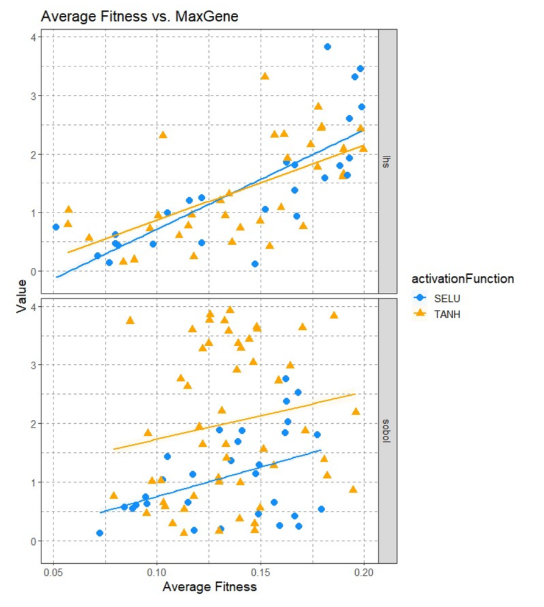
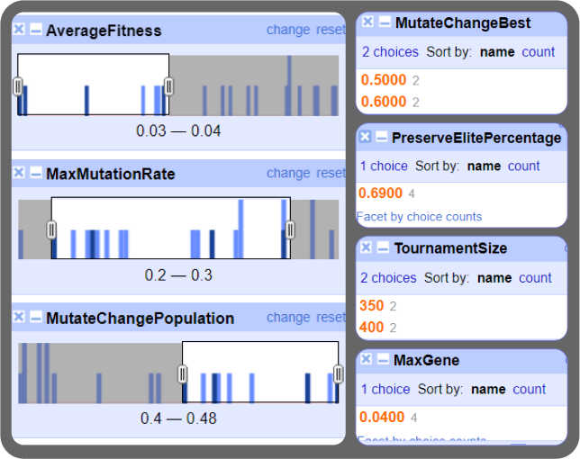

# Evolutionary Algorithm for Lunar Lander Optimization

# Intro

An evolutionary algorithm that utilizes a combination of random and grid search for parameter tuning, with several new functions and parameters added to enhance its performance.

# New Features

### Tournament Selection 🏆
The selection function has been modified to include a tournament addition that allows for better control over the selection process. The tournament size can be specified by the `tournamentSize` parameter.

### Elite Preservation 💪
The replace function has been modified to preserve a specified percentage of the "elite" individuals (best fitness) with the `preserveElitePercentage` parameter.

### Crossover Methods 🤝
Two methods for crossover, "one-point" and "two-point", have been implemented and can be controlled through the `crossoverMethod` parameter.

### Adaptive Mutation 🧪
The mutate function uses an adaptive mutation rate that adjusts based on the population diversity. The mutation rate can be controlled by the `minMutationRate`, `maxMutationRate`, and `maxDiversity` parameters.

### Activation Functions 💻
The algorithm includes both the hyperbolic tangent function (TANH) and the Scaled Exponential Linear Unit (SELU) activation functions. The activation function can be selected through the `activationFunction` parameter.

### Initialization Functions 🚀
The algorithm includes three initialization functions, random, Sobol, and LHS. The initialization function can be selected through the `initializationMethod` parameter.

## New Parameters

- `crossoverMethod`
- `preserveElitePercentage`
- `activationFunction`
- `initializationMethod`
- `mutationChangeBest`
- `mutationChangePopulation`
- `minMutationRate`
- `maxMutationRate`
- `maxDiversity`

## Deprecated Parameters

- `mutateRate`
- `mutateChange`

# Strategy

1. Automated Parameter Tuning 💻
The main objective is to automate the parameter tuning process. This is achieved through the implementation of Random Search and Grid Search algorithms. The results of the search will be stored in a `.csv` file for easy analysis.
- Grid Search: In grid search, a set of possible values for each parameter is defined and all combinations are tested. This approach is computationally expensive but tests all possibilities and the data is easier to analyze.
- Random Search: In random search, parameter values are randomly sampled from a predefined range. This approach is more efficient in terms of covering the search space, but the results can be unrelated, especially with smaller sample sizes. The plan is to use random search first to find a tight range of parameters that can be explored with grid search in the final stages.

2. Multithreading 🚀
To improve efficiency and reduce computing time, multithreading has been implemented using Java's executor framework. The program is set up to run on ten threads, which can be easily altered through the `numThreads` variable. The implementation calculates the average fitness value on test data after all ten threads finish executing, giving a mean average of ten runs for roughly the same computing time as one run. The improvement in overall efficiency and speed of evaluation is approximately `numThreads` times.

3. Plotting and Data Analysis 📈
After running the search, the results from the generated `.csv` file will be plotted using R-Studio. This will help find relationships and analyze the reasons and parameters responsible for good fitness results. The goal is to find parameter ranges that lead to satisfying fitness results and then evaluate the combinations using grid search.

# Experiments and Analysis
## 1st Random Search
- Iterations: 75

#### Fixed parameters:
- maxEvaluations: 5000
- numHidden: 20
- crossoverMethod: twoPoint
- maxDiversity: 300.0
- mutateChangeBest: 0.5
- minMutateRate: 0.001

#### Random parameters:
- exampleParameter: range (start – end)
  - min/maxGene: (0.1 - 5)
  - popSize: (30 – 400)
  - tournamentSize: (3 – 31)
  - preserveElitePercentage: (0.1 – 0.7)
  - initializationMethod: (sobol, lhs, random)
  - activationFunction
  - mutateChangePopulation: (0.1 – 0.9)
  - maxMutationRate: (0.2 – 0.7)
  - activationFunction: (SELU, TANH)

The results were plotted to visualize the findings. However, due to the small size of the dataset (75 runs), it is not possible to make any drastic conclusions. The aim of this experiment is not to find the optimal solution but to identify which parameters need to be refined to make the next search more efficient.

- The largest search space is observed in LHS activation.
- A clear correlation exists between MaxGene and Average fitness in LHS activation, where a lower MaxGene results in lower Average fitness. Optimal performance is observed when MaxGene is in the range of 0 - 2.5.
- Sobol activation function has minimal correlation with MaxGene and performs similar across the range of MaxGene of 0 - 4.
- The smallest search space is observed in the Random activation function, with optimal performance observed in the range of 0 - 2.
- MaxGene values exceeding 4.1 have been found to bring no benefits.
- The best performance is observed with MaxGene values in range 0.5-1.
- A cluster of values with MaxGene below 1
- Higher mutate change generally produced better results. Sobol highlights this best.
- No good results below 0.25 mutate change.

## 2nd Random Search
**Changes are highlighted in bold** 

### Fixed parameters: 
- maxEvaluations 5000 
- numHidden 20 
- crossoverMethod twoPoint 
- mutateChangeBest 0.5 
- minMutateRate 0.001 

### Random parameters: 
exampleParameter = range (start – end) 
min/maxGene (0.1 - 4) 

#### LHS Initialization Observations:
TANH activation function produces fitter populations when: 
- MaxMutationRate < 0.4 
- mutateChangePopulation < 0.6 

SELU activation function produces fitter populations when: 
- MaxMutationRate in range 0.25 – 0.6 
- mutateChangePopulation > 0.5

#### Ranges for Average Fitness Less than 0.1 
SELU ranges: 
- maxMutation – 0.29 – 0.67 
- Mutatechange – 0.51 – 0.79 
- Perserve Elite – 0.27 – 0.64 
- MaxMinGene – 0.14 – 0.74 

TANH ranges: 
- maxMutation – 0.22 – 0.36 
- mutateChange – 0.29 – 0.75 
- PerserveElite – 0.40 – 0.67 
- minMaxGene – 0.15 – 1.0 
- MaxDiversity – 136 - 500 

#### Combined and Simplified Ranges with Step 0.1 
- Max mutation – 0.2 – 0.6 
- mutateChange – 0.3 - 0.8 
- PerseveElite – 0.2 - 0.7  
- Gene – 0.1 – 1.1 

Grid search would be around 2000 combinations, which would take approximately 52 hours to complete. Another random search with tighter ranges would be performed instead.

## 3rd Random Search 
Iterations - 443

Changes are highlighted in bold

Fixed parameters:
- maxEvaluations: 5000 
- numHidden: 20 
- crossoverMethod: twoPoint 
- maxDiversity: 300.0 
- initialistionMethod: LHS 
- mutateChangeBest: 0.5 
- minMutateRate: 0.001 

Random parameters:
- maxGene (0.05 - 1.05) step 0.05
- popSize (110 - 1000) step 100 
- preserveElitePercentage (0.2 - 0.7) step 0.05 
- mutateChangePopulation (0.3 - 0.8) step 0.05 
- maxMutationRate (0.15 - 0.6) step 0.05 
- tournamentSize (1.3 - 2.7) times less than popSize 
- activationFunction (SELU, TANH) 

The following analysis highlights a clear distinction between the SELU and TANH activation functions:

- SELU activation consistently delivers superior results, particularly when fitness is below 0.06, with 12 populations as opposed to only 2 for TANH. 
- The relationship between MaxMutationRate and fitness is more distinct when using the SELU activation function. 

Utilizing the data obtained from random searches, the parameter ranges were narrowed down for a grid search strategy. Although numerous combinations are possible, the best 5 populations were given a stronger emphasis. 

Ideally, more random searches should be conducted focusing solely on the SELU activation, which would facilitate the identification of better ranges, particularly in terms of population size and tournament ratio. 

##  1st Grid Search 

Iterations – 96

Fixed parameters:
- maxEvaluations 10000
- numHidden 20
- crossoverMethod twoPoint
- maxDiversity 300.0
- mutateChangeBest 0.5
- minMutateRate 0.001
- activationFunction SELU

Parameters for combinations:
- MaxMutationRate (0.15, 0.25)
- MutateChangePopulation (0.3, 0.4)
- Perserve ElitePercantage (0.65, 0.45)
- popSize (350, 900)
- PopSize\Tournament ratio (1.7 , 2.44)
- MaxGene – (0.1, 0.55, 0.7)

Plotting the data did not yield any significant insights, however, it was easy to identify common combinations in the best results by analyzing the data in OpenRefine.

To my disappointment, the best result appeared to be more of an exception rather than a predictable model. After manual testing, I found that the main source of unpredictability was the high MaxMin gene parameter. This was confirmed through manual testing with the best operators identified from the grid search. It appears that the higher the Min and Max gene, the more unreliable the model becomes, producing random results each time. From my limited manual testing, it appeared that the model was more predictable with a MinMax gene of 0.1, giving results within a reasonable range (average of 10 runs), compared to 0.7, where the average was always quite different. Another important thing to note is that randomness can be due to the nature of "lhs" and its results outlined in the previous runs. Despite these findings, the grid search helped identify "optimal" or "near-optimal" parameters that produced good results:
- TournamentSize ~ 380
- Perserve ElitePercantage ~ 0.65
- max mutation rate ~ 0.18
- mutation change ~ 0.35
- mutateChangeBest ~ 0.5
- minMax Gene range ~ (0.1 – 0.5)

## 4th random search 
Iterations – 54 
-	maxMutationRate (0.12 - 0.25) 
-	mutateChangePopulation (0.3 - 0.5) 
-	tournamentSize (200, 350, 400) 
-	preserveElitePercentage (0.65, 0.70. 0.75) 
-	maxGene (0.1, 0.04, 0.07) 
-	minGene  -maxGene 
-	mutateChangeBest (0.4, 0.5, 0.6) 

With the values identified in the grid search, a quick random search made sense, as now we have a lot of fixed values, and its much easier to identify the optimal values for the “unknowns”. A quick and quite limited run was performed, but despite this, it was helpful as it showed that lower Min/Max Gene generally produce better results, also, it helped “solidify” the values for the last run. 

This helped fix 3 parameters - TournamentSize, PerserveElite and mutateChangeBest and identify ranges for the final run. 

## 5th random search
Fixed parameters: 
-	tournamentSize = 380;  
-	crossoverMethod = "twoPoint";  
-	preserveElitePercentage  = 0.7; 
-	activationFunction = "SELU";  
-	initialistionMethod = "lhs";  
-	mutateChangeBest = 0.55;  
-	mutateChangePopulation = 0.3 
-	minMutationRate = 0.001;  
-	maxMutationRate = 0.25;  
-	maxDiversity = 300; 

Random parameters: 
-	Maxmutation rate range random – 0.20 – 0.30 
-	Mutate change population random range  0.37 – 0.52 
-	Max gene random range 0.05 – 0.01 

After data analysis, the following ranges deliver average Fitness on test: 0.0226 to 0.0608: 
-	maxGene (0.03 – 0.04) 
-	MutateChangePopulation (0.39 – 0.44) 
-	MaxMutationRate (0.21 – 0.25) 

# Results
Best result on test (single run)_ – 0.00667

Number of Runs: 	12
Mean fitness Test: 	0.037
Mean fitness Train: 	0.012
Activation Function: 	SELU
numHidden 	20
minGene 	-0.035
maxGene 	+0.035
maxEvaluations 	20000
popSize 	900
tournamentSize 	380
crossoverMethod 	twoPoint
preserveElitePercentage 	0.7
initialistionMethod 	lhs
mutateChangeBest 	0.55
mutateChangePopulation 	0.42
minMutationRate 	0.001
maxMutationRate 	0.23
maxDiversity 	300

# Future Work
There are numerous ways to enhance an algorithm's performance. For instance, you can modify the existing algorithm, improve the hill-climbing operator's implementation, or introduce new operators and fine-tune the existing ones. Additionally, it is possible to incorporate adaptability parameters for operators other than mutation. 
Parameter tuning can also be optimized. In the current approach, there are gaps in parameter exploration, such as an insufficient examination of the number of hidden nodes. Also, minimum and maximum gene values can be explored individually, rather than using a uniform range. The initial grid search may have been conducted too early, leading to limited exploration of parameter ranges. 
Expanding random search and utilizing broader parameter ranges can help discover more effective combinations, especially when time and computing resources are not constraints. Furthermore, implementing Bayesian optimization can significantly improve the overall results, as this approach is known to yield superior outcomes compared to other optimization techniques. 
